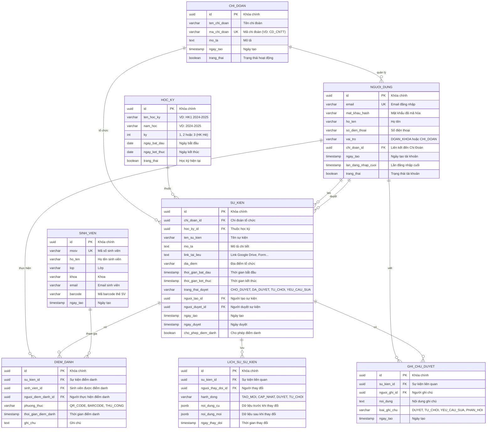
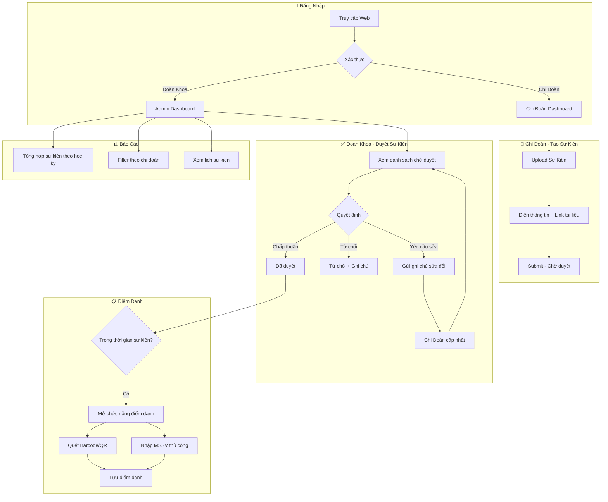

# 📊 Database Schema - Hệ Thống Quản Lý Sự Kiện Đoàn Khoa

## Entity Relationship Diagram



---

## 🗂️ Mô Tả Chi Tiết Các Bảng

### 1. CHI_DOAN (Chi Đoàn)
> Lưu trữ thông tin các chi đoàn trong đoàn khoa

| Cột | Kiểu | Ràng buộc | Mô tả |
|-----|------|-----------|-------|
| `id` | UUID | PRIMARY KEY | Khóa chính |
| `ten_chi_doan` | VARCHAR(255) | NOT NULL | Tên đầy đủ của chi đoàn |
| `ma_chi_doan` | VARCHAR(50) | UNIQUE | Mã viết tắt (VD: CD_CNTT) |
| `mo_ta` | TEXT | | Mô tả chi đoàn |
| `trang_thai` | BOOLEAN | DEFAULT TRUE | Active/Inactive |

---

### 2. NGUOI_DUNG (Người Dùng)
> Quản lý tài khoản đăng nhập cho cả Đoàn Khoa và Chi Đoàn

| Cột | Kiểu | Ràng buộc | Mô tả |
|-----|------|-----------|-------|
| `id` | UUID | PRIMARY KEY | Khóa chính |
| `email` | VARCHAR(255) | UNIQUE, NOT NULL | Email đăng nhập |
| `mat_khau_hash` | VARCHAR(255) | NOT NULL | Mật khẩu đã băm |
| `ho_ten` | VARCHAR(255) | NOT NULL | Họ tên người dùng |
| `vai_tro` | VARCHAR(20) | CHECK | `DOAN_KHOA` hoặc `CHI_DOAN` |
| `chi_doan_id` | UUID | FOREIGN KEY | NULL nếu là Đoàn Khoa |

---

### 3. HOC_KY (Học Kỳ)
> Quản lý các học kỳ để phân loại sự kiện

| Cột | Kiểu | Ràng buộc | Mô tả |
|-----|------|-----------|-------|
| `id` | UUID | PRIMARY KEY | Khóa chính |
| `ten_hoc_ky` | VARCHAR(100) | NOT NULL | VD: "HK1 2024-2025" |
| `nam_hoc` | VARCHAR(20) | NOT NULL | VD: "2024-2025" |
| `ky` | INT | CHECK (1,2,3) | Học kỳ 1, 2 hoặc Hè |
| `ngay_bat_dau` | DATE | NOT NULL | Ngày bắt đầu |
| `ngay_ket_thuc` | DATE | NOT NULL | Ngày kết thúc |

---

### 4. SU_KIEN (Sự Kiện)
> Bảng chính lưu trữ thông tin các sự kiện

| Cột | Kiểu | Ràng buộc | Mô tả |
|-----|------|-----------|-------|
| `id` | UUID | PRIMARY KEY | Khóa chính |
| `chi_doan_id` | UUID | FOREIGN KEY | Chi đoàn tổ chức |
| `hoc_ky_id` | UUID | FOREIGN KEY | Thuộc học kỳ nào |
| `ten_su_kien` | VARCHAR(500) | NOT NULL | Tên sự kiện |
| `link_tai_lieu` | TEXT | | Link Drive, Form, etc. |
| `thoi_gian_bat_dau` | TIMESTAMP | NOT NULL | Bắt đầu sự kiện |
| `thoi_gian_ket_thuc` | TIMESTAMP | NOT NULL | Kết thúc sự kiện |
| `trang_thai_duyet` | VARCHAR(20) | CHECK | Trạng thái duyệt |
| `cho_phep_diem_danh` | BOOLEAN | DEFAULT FALSE | Mở điểm danh |

**Trạng thái duyệt:**
- `CHO_DUYET` - Chờ Đoàn Khoa duyệt
- `DA_DUYET` - Đã được chấp thuận
- `TU_CHOI` - Bị từ chối
- `YEU_CAU_SUA` - Yêu cầu chỉnh sửa

---

### 5. GHI_CHU_DUYET (Ghi Chú Duyệt)
> Lưu các ghi chú/comment trong quá trình duyệt sự kiện

| Cột | Kiểu | Ràng buộc | Mô tả |
|-----|------|-----------|-------|
| `id` | UUID | PRIMARY KEY | Khóa chính |
| `su_kien_id` | UUID | FOREIGN KEY | Sự kiện liên quan |
| `nguoi_ghi_id` | UUID | FOREIGN KEY | Người viết ghi chú |
| `noi_dung` | TEXT | NOT NULL | Nội dung ghi chú |
| `loai_ghi_chu` | VARCHAR(20) | CHECK | Loại ghi chú |

---

### 6. SINH_VIEN (Sinh Viên)
> Danh sách sinh viên để điểm danh

| Cột | Kiểu | Ràng buộc | Mô tả |
|-----|------|-----------|-------|
| `id` | UUID | PRIMARY KEY | Khóa chính |
| `mssv` | VARCHAR(20) | UNIQUE, NOT NULL | Mã số sinh viên |
| `ho_ten` | VARCHAR(255) | NOT NULL | Họ tên |
| `barcode` | VARCHAR(100) | | Mã barcode thẻ SV |

---

### 7. DIEM_DANH (Điểm Danh)
> Lưu lịch sử điểm danh sinh viên tại các sự kiện

| Cột | Kiểu | Ràng buộc | Mô tả |
|-----|------|-----------|-------|
| `id` | UUID | PRIMARY KEY | Khóa chính |
| `su_kien_id` | UUID | FOREIGN KEY | Sự kiện |
| `sinh_vien_id` | UUID | FOREIGN KEY | Sinh viên |
| `phuong_thuc` | VARCHAR(20) | CHECK | QR_CODE, BARCODE, THU_CONG |
| `thoi_gian_diem_danh` | TIMESTAMP | DEFAULT NOW | Thời gian |

> [!IMPORTANT]
> Ràng buộc UNIQUE(su_kien_id, sinh_vien_id) đảm bảo mỗi sinh viên chỉ điểm danh 1 lần cho 1 sự kiện.

---

### 8. LICH_SU_SU_KIEN (Lịch Sử Sự Kiện)
> Audit log theo dõi mọi thay đổi của sự kiện

| Cột | Kiểu | Ràng buộc | Mô tả |
|-----|------|-----------|-------|
| `id` | UUID | PRIMARY KEY | Khóa chính |
| `su_kien_id` | UUID | FOREIGN KEY | Sự kiện |
| `hanh_dong` | VARCHAR(50) | NOT NULL | TAO_MOI, CAP_NHAT, DUYET... |
| `noi_dung_cu` | JSONB | | Dữ liệu trước khi đổi |
| `noi_dung_moi` | JSONB | | Dữ liệu sau khi đổi |

---

## 🔄 Luồng Hoạt Động



---

## 📑 SQL Scripts

```sql
-- =============================================
-- TẠO CÁC BẢNG
-- =============================================

CREATE TABLE chi_doan (
    id              UUID PRIMARY KEY DEFAULT gen_random_uuid(),
    ten_chi_doan    VARCHAR(255) NOT NULL,
    ma_chi_doan     VARCHAR(50) UNIQUE NOT NULL,
    mo_ta           TEXT,
    ngay_tao        TIMESTAMP DEFAULT CURRENT_TIMESTAMP,
    trang_thai      BOOLEAN DEFAULT TRUE
);

CREATE TABLE nguoi_dung (
    id              UUID PRIMARY KEY DEFAULT gen_random_uuid(),
    email           VARCHAR(255) UNIQUE NOT NULL,
    mat_khau_hash   VARCHAR(255) NOT NULL,
    ho_ten          VARCHAR(255) NOT NULL,
    so_dien_thoai   VARCHAR(20),
    vai_tro         VARCHAR(20) NOT NULL CHECK (vai_tro IN ('DOAN_KHOA', 'CHI_DOAN')),
    chi_doan_id     UUID REFERENCES chi_doan(id),
    ngay_tao        TIMESTAMP DEFAULT CURRENT_TIMESTAMP,
    lan_dang_nhap_cuoi TIMESTAMP,
    trang_thai      BOOLEAN DEFAULT TRUE
);

CREATE TABLE hoc_ky (
    id              UUID PRIMARY KEY DEFAULT gen_random_uuid(),
    ten_hoc_ky      VARCHAR(100) NOT NULL,
    nam_hoc         VARCHAR(20) NOT NULL,
    ky              INT NOT NULL CHECK (ky IN (1, 2, 3)),
    ngay_bat_dau    DATE NOT NULL,
    ngay_ket_thuc   DATE NOT NULL,
    trang_thai      BOOLEAN DEFAULT TRUE
);

CREATE TABLE su_kien (
    id                  UUID PRIMARY KEY DEFAULT gen_random_uuid(),
    chi_doan_id         UUID NOT NULL REFERENCES chi_doan(id),
    hoc_ky_id           UUID NOT NULL REFERENCES hoc_ky(id),
    ten_su_kien         VARCHAR(500) NOT NULL,
    mo_ta               TEXT,
    link_tai_lieu       TEXT,
    dia_diem            VARCHAR(500),
    thoi_gian_bat_dau   TIMESTAMP NOT NULL,
    thoi_gian_ket_thuc  TIMESTAMP NOT NULL,
    trang_thai_duyet    VARCHAR(20) DEFAULT 'CHO_DUYET' 
                        CHECK (trang_thai_duyet IN ('CHO_DUYET', 'DA_DUYET', 'TU_CHOI', 'YEU_CAU_SUA')),
    nguoi_tao_id        UUID REFERENCES nguoi_dung(id),
    nguoi_duyet_id      UUID REFERENCES nguoi_dung(id),
    ngay_tao            TIMESTAMP DEFAULT CURRENT_TIMESTAMP,
    ngay_duyet          TIMESTAMP,
    ngay_cap_nhat       TIMESTAMP DEFAULT CURRENT_TIMESTAMP,
    cho_phep_diem_danh  BOOLEAN DEFAULT FALSE
);

CREATE TABLE ghi_chu_duyet (
    id              UUID PRIMARY KEY DEFAULT gen_random_uuid(),
    su_kien_id      UUID NOT NULL REFERENCES su_kien(id) ON DELETE CASCADE,
    nguoi_ghi_id    UUID NOT NULL REFERENCES nguoi_dung(id),
    noi_dung        TEXT NOT NULL,
    loai_ghi_chu    VARCHAR(20) CHECK (loai_ghi_chu IN ('DUYET', 'TU_CHOI', 'YEU_CAU_SUA', 'PHAN_HOI')),
    ngay_tao        TIMESTAMP DEFAULT CURRENT_TIMESTAMP
);

CREATE TABLE sinh_vien (
    id              UUID PRIMARY KEY DEFAULT gen_random_uuid(),
    mssv            VARCHAR(20) UNIQUE NOT NULL,
    ho_ten          VARCHAR(255) NOT NULL,
    lop             VARCHAR(50),
    khoa            VARCHAR(255),
    email           VARCHAR(255),
    barcode         VARCHAR(100),
    ngay_tao        TIMESTAMP DEFAULT CURRENT_TIMESTAMP
);

CREATE TABLE diem_danh (
    id              UUID PRIMARY KEY DEFAULT gen_random_uuid(),
    su_kien_id      UUID NOT NULL REFERENCES su_kien(id) ON DELETE CASCADE,
    sinh_vien_id    UUID NOT NULL REFERENCES sinh_vien(id),
    nguoi_diem_danh_id UUID REFERENCES nguoi_dung(id),
    phuong_thuc     VARCHAR(20) CHECK (phuong_thuc IN ('QR_CODE', 'BARCODE', 'THU_CONG')),
    thoi_gian_diem_danh TIMESTAMP DEFAULT CURRENT_TIMESTAMP,
    ghi_chu         TEXT,
    UNIQUE(su_kien_id, sinh_vien_id)
);

CREATE TABLE lich_su_su_kien (
    id              UUID PRIMARY KEY DEFAULT gen_random_uuid(),
    su_kien_id      UUID NOT NULL REFERENCES su_kien(id) ON DELETE CASCADE,
    nguoi_thay_doi_id UUID REFERENCES nguoi_dung(id),
    hanh_dong       VARCHAR(50) NOT NULL,
    noi_dung_cu     JSONB,
    noi_dung_moi    JSONB,
    ngay_thay_doi   TIMESTAMP DEFAULT CURRENT_TIMESTAMP
);

-- =============================================
-- TẠO INDEXES
-- =============================================

CREATE INDEX idx_su_kien_chi_doan ON su_kien(chi_doan_id);
CREATE INDEX idx_su_kien_hoc_ky ON su_kien(hoc_ky_id);
CREATE INDEX idx_su_kien_trang_thai ON su_kien(trang_thai_duyet);
CREATE INDEX idx_su_kien_thoi_gian ON su_kien(thoi_gian_bat_dau, thoi_gian_ket_thuc);
CREATE INDEX idx_diem_danh_su_kien ON diem_danh(su_kien_id);
CREATE INDEX idx_sinh_vien_mssv ON sinh_vien(mssv);
CREATE INDEX idx_sinh_vien_barcode ON sinh_vien(barcode);
CREATE INDEX idx_nguoi_dung_chi_doan ON nguoi_dung(chi_doan_id);
```
